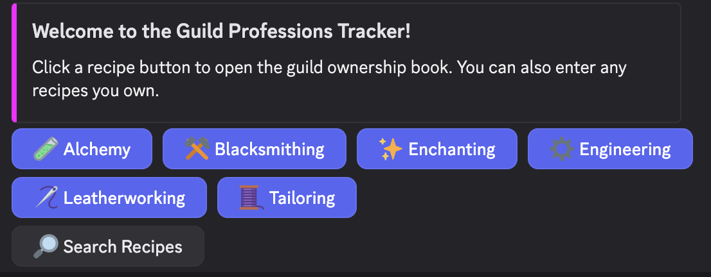
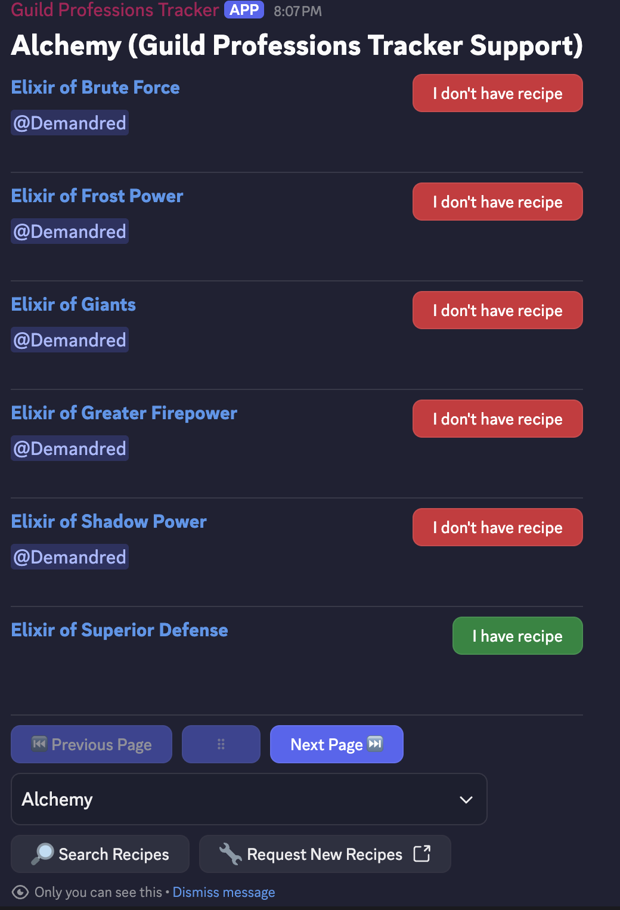

# WoW Guild Professions Tracker

## Installation and Usage

Use this link to install the bot onto your server: <a href="https://discord.com/oauth2/authorize?client_id=1377491013677092970">https://discord.com/oauth2/authorize?client_id=1377491013677092970</a>.  You'll need admin privileges on the server you want to use.

Create a channel and type <code>!recipes</code> to initialize the main screen for the bot.  (Your original message will be removed by the bot.)
                

Click any of the buttons and the bot send a message to you (and you only!) and allow you to mark your recipes for the Discord server.

## Frequently Asked Questions

#### Do I need to set my recipes for each server that I'm on?
Yes.  Because a server usually signifies a guild, your recipe data is stored per server.  This allows the same Discord account to have recipes for multiple factions and WoW servers!

#### How are new recipes added to the app?
I've added the recipes that my guild and I regularly use and am adding new ones regularly.  If you want me to add new recipes, leave a response on this Google Form: .  Note: the bot also has a button with a link to the same form.

#### I've got another question or issue, how do I contact you?
There's a support Discord for any additional questions and concerns.  Join here: <a href="https://discord.gg/MCauqfP9Qg">https://discord.gg/MCauqfP9Qg</a>

## Privacy Policy
<a href="https://wow-gpt.github.io/docs/privacy.html">https://wow-gpt.github.io/docs/privacy.html</a>

## Terms of Service
<a href="https://wow-gpt.github.io/docs/tos.html">https://wow-gpt.github.io/docs/tos.html</a>

